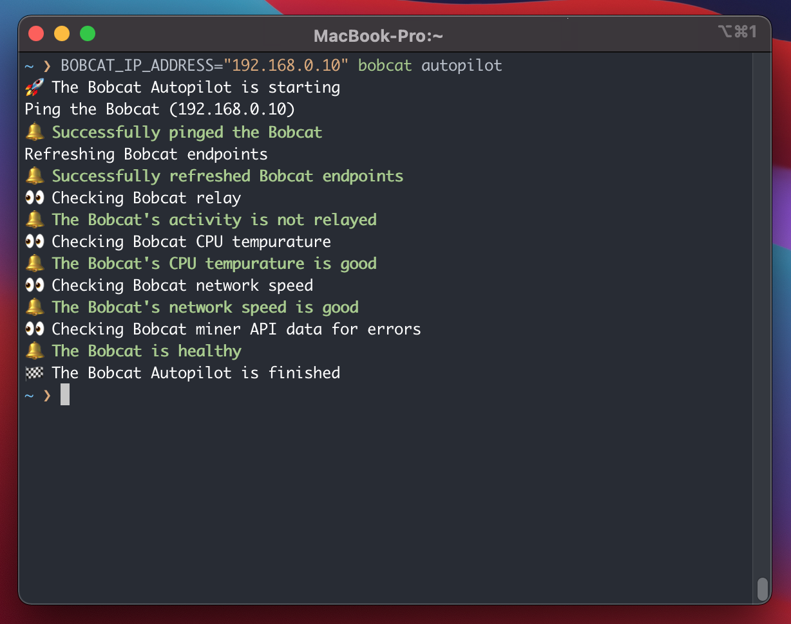
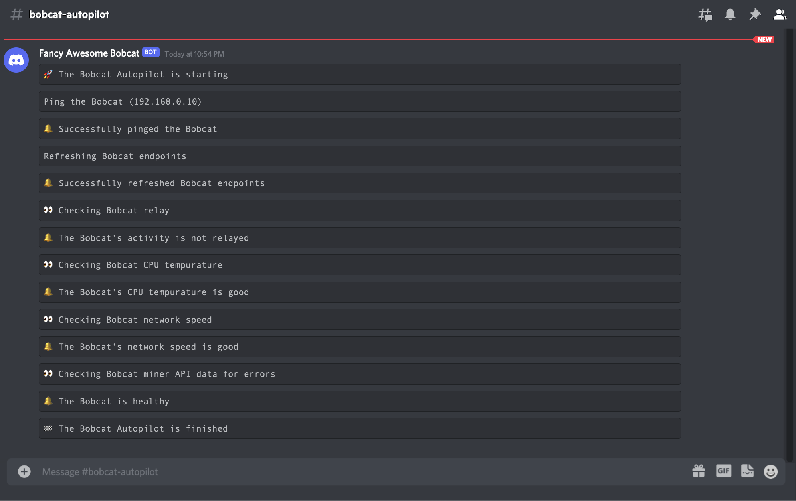

[](https://pypi.org/project/bobcat-miner/)
[](https://github.com/aidanmelen/bobcat-miner-python/actions/workflows/tests.yaml)
[](https://github.com/aidanmelen/bobcat-miner-python/actions/workflows/release.yaml)
[](https://hub.docker.com/r/aidanmelen/bobcat)

# bobcat miner python

A command line tool used to automate the Bobcat miner. This project also offers a robust python SDK's for interacting with the Bobcat miner.

## Install

```bash
# install command line tools
pipx install bobcat-miner

# install SDK
pip3 install bobcat-miner
```

Please see this [guide](https://packaging.python.org/en/latest/guides/installing-stand-alone-command-line-tools/) for more information about installing stand alone command line tools with [pipx](https://pypa.github.io/pipx/).

## Bobcat Autopilot Usage

Follow these [instructions](https://bobcatminer.zendesk.com/hc/en-us/articles/4412905935131-How-to-Access-the-Diagnoser) to find you bobcat miner's ip address. Then either set the `BOBCAT_IP_ADDRESS` environment variable or the command line option e.g. `bobcat --ip-address 192.168.1.10 autopilot`.



The Bobcat Autopilot will stream events to a Discord channel when the `BOBCAT_DISCORD_WEBHOOK_URL` environment variable is provided.



## Bobcat Autopilot SDK Usage

```python
import bobcat_miner

bobcat = bobcat_miner.Bobcat("192.168.1.10")
autopilot = bobcat_miner.Autopilot(bobcat)

# Automatically diagnose and repair the Bobcat
autopilot.run()

# diagnostics
autopilot.is_relayed()
autopilot.is_temp_dangerous()
autopilot.is_network_speed_slow()
autopilot.is_syncing()
autopilot.has_errors()

# actions
autopilot.ping()        # Ping the Bobcat until it connects or attempts are maxed out
autopilot.reboot()      # Reboot the Bobcat and wait for connection
autopilot.reset()       # Reset the Bobcat and wait for connection or exceeds max attempts
autopilot.resync()      # Fastsync the Bobcat and wait for connection
autopilot.fastsync()    # Fastsync the Bobcat until the gap is less than 400 or exceeds max attempts
autopilot.is_syncing()  # Poll the Bobcat's gap to see if it is syncing over time
```

## Bobcat SDK Usage

```python
import bobcat_miner

bobcat = bobcat_miner.Bobcat("192.168.1.10")

# refresh
bobcat.refresh_status()
bobcat.refresh_miner()
bobcat.refresh_speed()
bobcat.refresh_temp()
bobcat.refresh_dig()
bobcat.refresh()

# properties
bobcat.status
bobcat.gap
bobcat.miner_height
bobcat.blockchain_height
bobcat.epoch
bobcat.tip
bobcat.ota_version
bobcat.region
bobcat.frequency_plan
bobcat.animal
bobcat.name
bobcat.pubkey
bobcat.state
bobcat.miner_status
bobcat.names
bobcat.image
bobcat.created
bobcat.p2p_status
bobcat.ports_desc
bobcat.ports
bobcat.private_ip
bobcat.public_ip
bobcat.peerbook
bobcat.peerbook_miner
bobcat.peerbook_listen_address
bobcat.peerbook_peers
bobcat.timestamp
bobcat.error
bobcat.temp0
bobcat.temp1
bobcat.temp0_c
bobcat.temp1_c
bobcat.temp0_f
bobcat.temp1_f
bobcat.download_speed
bobcat.upload_speed
bobcat.latency
bobcat.dig_name
bobcat.dig_message
bobcat.dig_dns
bobcat.dig_records

# actions
bobcat.ping()
bobcat.reboot()
bobcat.reset()
bobcat.resync()
bobcat.fastsync()

# diagnostics
bobcat.is_bobcat()
```

## Troubleshooting

Please see [No Witness's Troubleshooting Guide](https://www.nowitness.org/troubleshooting/) for more information.

## Donations

Donations are welcome and appreciated! :gift:

[](https://explorer-v1.helium.com/accounts/14HmckNU4WHDDtGH29FMqVENzZAYh5a9XRiLfY2AN6ghfHMvAuR)

HNT: [14HmckNU4WHDDtGH29FMqVENzZAYh5a9XRiLfY2AN6ghfHMvAuR](https://explorer-v1.helium.com/accounts/14HmckNU4WHDDtGH29FMqVENzZAYh5a9XRiLfY2AN6ghfHMvAuR)
